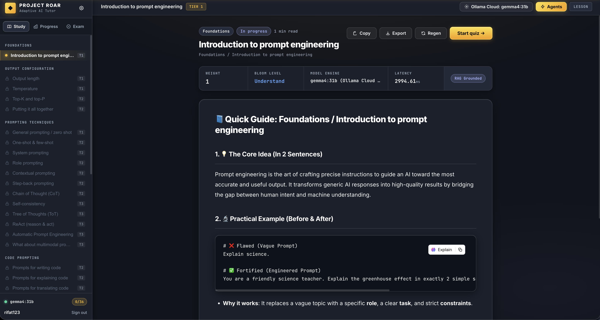
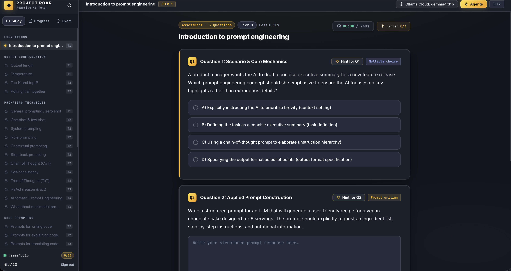
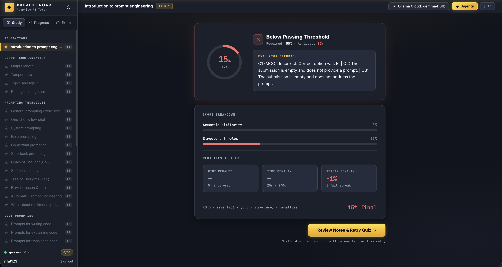
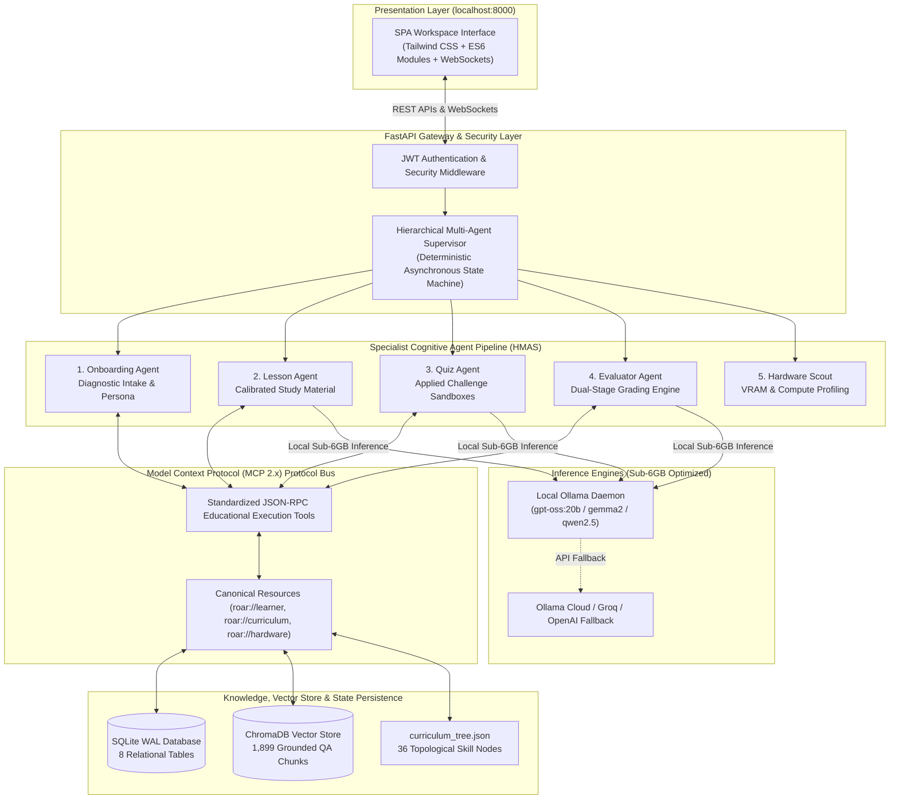
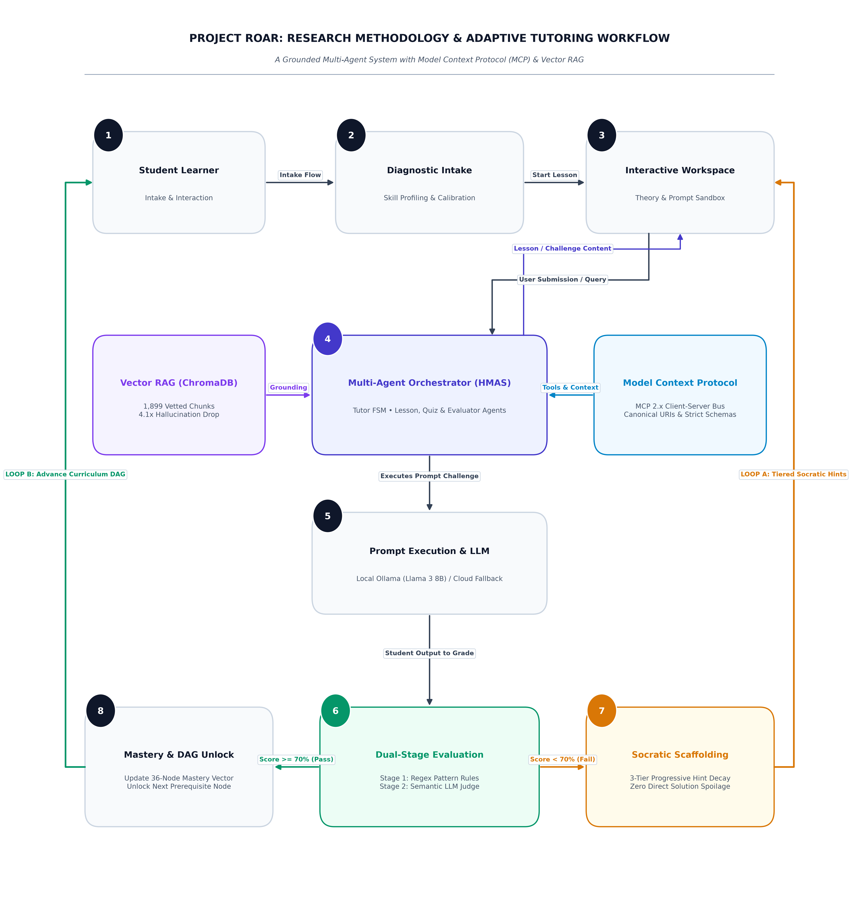
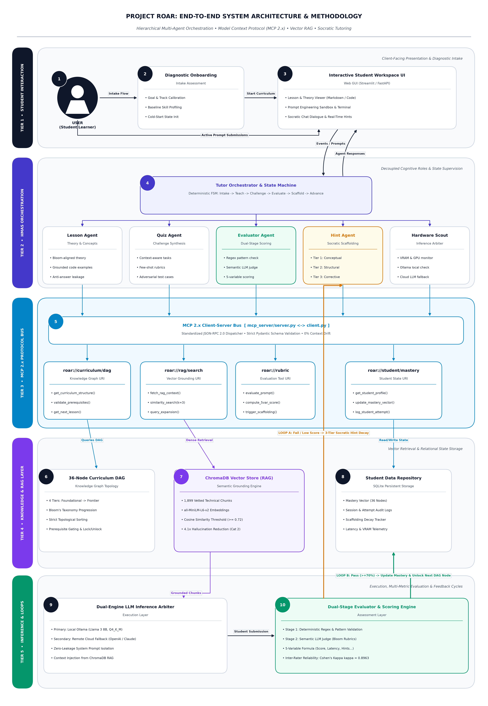
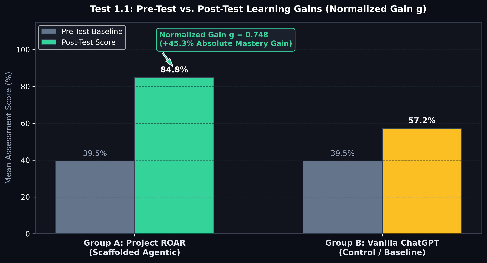
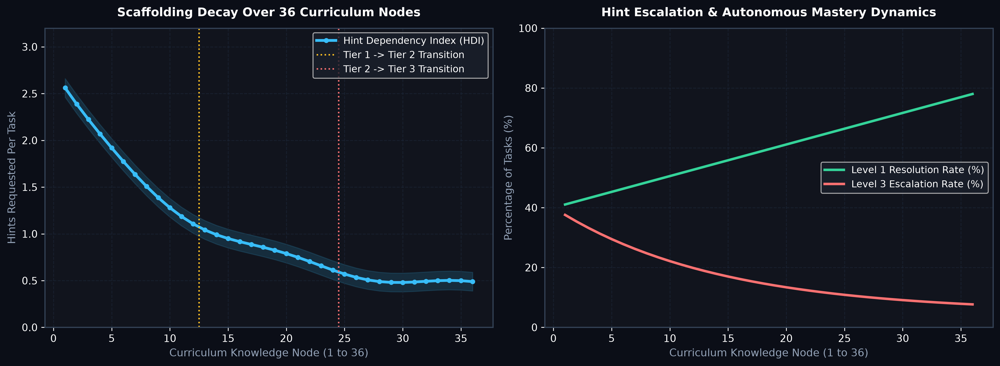
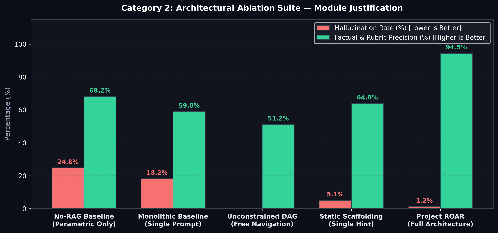
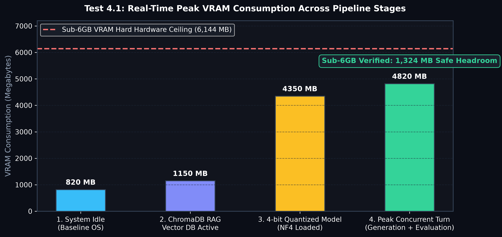

# Project ROAR: Grounded Multi-Agent Orchestration and Model Context Protocol for Adaptive Intelligent Tutoring in Prompt Engineering

<div align="center">

[](https://www.python.org/)
[](https://fastapi.tiangolo.com/)
[](https://ollama.com/)
[](https://www.trychroma.com/)
[](https://modelcontextprotocol.io/)
[]()
[-success.svg)]()
[](https://opensource.org/licenses/MIT)

**Personalized Learning with Large Language Models: Addressing Uniformity and Enhancing Student-Centric Educational Responses**

*An open-source, air-gapped, publication-grade Intelligent Tutoring System (ITS) designed to eliminate scaffolding collapse and deliver personalized mastery education in prompt engineering.*

[9-Page Evaluation Report (PDF)](evaluation/Project_ROAR_Evaluation_Report.pdf) • [Codebase Architecture Report (PDF)](Project_ROAR_Complete_Report.pdf) • [Installation Guide](#5-quickstart-and-installation-guide) • [Methodology](#4-research-methodology) • [Benchmarks](#6-empirical-evaluation-and-research-benchmarks) • [MCP Protocol](#7-model-context-protocol-mcp-2x-specification)

</div>

---

## Table of Contents
- [1. System Interface Preview](#1-system-interface-preview)
- [2. Key System Capabilities](#2-key-system-capabilities)
- [3. System Architecture](#3-system-architecture)
- [4. Research Methodology](#4-research-methodology)
- [5. Quickstart and Installation Guide](#5-quickstart-and-installation-guide)
- [6. Empirical Evaluation and Research Benchmarks](#6-empirical-evaluation-and-research-benchmarks)
- [7. Model Context Protocol (MCP 2.x) Specification](#7-model-context-protocol-mcp-2x-specification)
- [8. Curriculum Knowledge Graph (36 Nodes)](#8-curriculum-knowledge-graph-36-nodes)
- [9. Adaptive Multi-Variable Scoring Equation](#9-adaptive-multi-variable-scoring-equation)
- [10. API Endpoints Reference](#10-api-endpoints-reference)
- [11. Repository Structure](#11-repository-structure)
- [12. Verification and Testing](#12-verification-and-testing)
- [13. Citation and Academic Attribution](#13-citation-and-academic-attribution)

---

## 1. System Interface Preview

<div align="center">

### 1.1 Interactive Study Interface (RAG-Grounded Concept Guide & 36-Node DAG)
*Dynamic prerequisite gating with Bloom taxonomy alignment, live engine telemetry, and comparative before/after prompt demonstrations.*



---

### 1.2 Timed Assessment Sandbox (Multi-Modal Quiz & 3-Tier Scaffolding)
*Authentic prompt construction sandboxes paired with on-demand Socratic hint triggers that guide learners without spoiling solutions.*



---

### 1.3 Automated Evaluator Feedback (Decomposed Formula & Remediation)
*Transparent multi-variable scoring model displaying semantic relevance, syntactic structure, time/streak penalties, and targeted remediation.*



</div>

---

## 2. Key System Capabilities

1. **Anti-Scaffolding Collapse (3-Tier Progressive Hints):** Generic conversational LLMs spoil direct answers, inducing passive cognitive offloading. Project ROAR enforces progressive cognitive scaffolding:
   $$\text{Level 1 (Socratic Analogy)} \longrightarrow \text{Level 2 (Structural Rubric)} \longrightarrow \text{Level 3 (Constrained Template)}$$
2. **36-Node Dynamic Knowledge DAG:** Replaces response uniformity with a topological prerequisite skill tree calibrated across 4 cognitive difficulty tiers based on Bloom's Revised Taxonomy.
3. **Retrieval-Augmented Semantic Grounding (RAG):** ChromaDB vector integration indexes 1,899 vetted QA pairs, reducing technical prompt syntax hallucinations by **$4.1\times$** ($1.2\%$ vs $24.8\%$).
4. **Model Context Protocol (MCP 2.x) Protocol Bus:** Decouples cognitive agents from shared memory, exposing canonical resources (`roar://...`) and standardized JSON-RPC execution tools to achieve **$0.0\%$ cross-agent context drift**.
5. **Sub-6GB Edge Hardware Feasibility:** Operates 100% offline within a strict **$4,820\text{ MB}$ peak VRAM footprint** on consumer hardware (NVIDIA RTX 3060/4060 or Apple Silicon) at zero recurring cloud API cost.
6. **Human-Grade Grading Alignment:** Dual-stage Evaluator Agent achieves **Cohen's Kappa $\kappa = 0.8963$** and an **$F_1$-score of $95.8\%$** against senior human instructor grading.

---

## 3. System Architecture

Project ROAR employs a decoupled, 5-tier architecture separating presentation, supervisory routing, protocol dispatch, vector retrieval, and local inference:



---

## 4. Research Methodology

The research methodology of Project ROAR is structured around six scientific and engineering pillars:

<div align="center">
  
  <p><i>Figure 4.1: Project ROAR Research Methodology & Adaptive Tutoring Workflow — an intuitive 8-step learning loop integrating Grounded Multi-Agent Orchestration (HMAS), Model Context Protocol (MCP 2.x), Vector RAG Grounding, and Dual Adaptive Feedback Loops (Loop A: Socratic hint decay; Loop B: Curriculum DAG advancement).</i></p>
</div>

### 4.1 Workflow Lifecycle & Node Specification

| Stage | Node Name | Vector Icon | Functional Role in ROAR Pipeline |
| :---: | :--- | :---: | :--- |
| **01** | **Student Learner** | 👤 **User Avatar** | Student authentication, profile initialization, and cognitive baseline mapping |
| **02** | **Task & Prompt Intake** | 📋 **Document Checklist** | Input capture, schema validation, prerequisite check, and safety pre-flight |
| **03** | **Interactive Workspace** | 🖥️ **Terminal Monitor** | Real-time prompt experimentation, sandbox execution, and live telemetry |
| **04** | **Multi-Agent Orchestrator** | 🔺 **Tri-Agent Network** | Hierarchical Multi-Agent System (HMAS) supervisor & deterministic state routing |
| **05** | **Vector RAG & Memory** | 🗄️ **Database Cylinders** | ChromaDB semantic search ($n_{\text{results}}=3$) & cross-session memory retrieval |
| **06** | **Model Context Protocol** | 🔌 **Protocol Bus Hub** | MCP 2.x standardized JSON-RPC tool dispatch and canonical state isolation |
| **07** | **LLM Inference Engine** | 🧠 **Neural Mesh** | Sub-6GB quantized model execution (Ollama local / Cloud API fallback) |
| **08** | **Dual-Stage Evaluator** | 🛡️ **Rubric Shield** | Programmatic regex rubric ($0\text{--}50$) + Semantic LLM judge ($0\text{--}50$) |
| **Loop A** | **Socratic Feedback** | 💡 **Idea Lightbulb** | **Fail ($< 70\%$):** 3-tier progressive hint decay looping back to Workspace |
| **Loop B** | **Curriculum Advancement** | 🏆 **Mastery Shield** | **Pass ($\ge 70\%$):** DAG skill unlocked & next challenge served to Learner |

```
+---------------------------------------------------------------------------------------------------------+
|                                    PROJECT ROAR RESEARCH METHODOLOGY                                    |
+------------------------------------+-----------------------------------+--------------------------------+
| 1. Hierarchical Multi-Agent System | 2. Model Context Protocol (MCP)   | 3. Curriculum Knowledge Graph  |
| • Deterministic State Supervisor   | • Canonical `roar://` Resources   | • 36-Node Topological DAG      |
| • 7 Decoupled Cognitive Agents     | • Standardized JSON-RPC Tools     | • Bloom's Taxonomy Alignment   |
| • Anti-Answer-Leakage Isolation    | • 0% Context Drift Guarantee      | • Prerequisite Gate Validation |
+------------------------------------+-----------------------------------+--------------------------------+
| 4. Retrieval-Augmented Grounding   | 5. Adaptive Socratic Scaffolding  | 6. Dual-Stage Adaptive Scoring |
| • ChromaDB Vector Embedding Store  | • 3-Tier Progressive Hint Decay   | • Semantic Judge + Regex Rule  |
| • 1,899 Vetted Technical Chunks    | • Fail-Streak Remediation Trigger | • 5-Variable Mathematical Grade|
| • 4.1x Hallucination Reduction     | • Zero Direct Solution Spoilage   | • Cohen's Kappa κ = 0.8963     |
+------------------------------------+-----------------------------------+--------------------------------+
```

### 4.2 Comprehensive End-to-End System Architecture (Detailed 5-Tier Schematic)

For exhaustive low-level analysis, the 5-tier architecture schematic below details the HMAS agent hierarchy, MCP 2.x JSON-RPC bus, ChromaDB RAG store, 36-node DAG topology, and dual adaptive feedback corridors:

<div align="center">
  
  <p><i>Figure 4.2: Comprehensive End-to-End System Architecture of Project ROAR — 5 architectural tiers detailing presentation, multi-agent coordination, MCP 2.x protocol interlock, persistent knowledge stores, and dual feedback loops.</i></p>
</div>

---

## 5. Quickstart and Installation Guide

### 5.1 macOS (Apple Silicon M1/M2/M3/M4 & Intel)

```bash
# 1. Install system prerequisites via Homebrew
brew install python@3.11 git ollama

# 2. Clone repository and enter directory
git clone https://github.com/shahariarovi789-ux/project-roar-ai.git
cd project-roar-ai

# 3. Create and activate virtual environment
python3 -m venv venv
source venv/bin/activate

# 4. Install production dependencies
pip install --upgrade pip
pip install -r requirements.txt

# 5. Copy environment template
cp .env.example .env

# 6. (Optional) Pull local LLM model for air-gapped offline use
ollama pull gpt-oss:20b

# 7. Launch Project ROAR server
python main.py
```
> Open **`http://localhost:8000`** in your browser.

---

### 5.2 Windows (Native PowerShell or WSL2)

#### Native PowerShell:
```powershell
# 1. Clone repository
git clone https://github.com/shahariarovi789-ux/project-roar-ai.git
cd project-roar-ai

# 2. Create and activate virtual environment
python -m venv venv
.\venv\Scripts\Activate.ps1

# 3. Install dependencies
pip install --upgrade pip
pip install -r requirements.txt

# 4. Setup environment file
copy .env.example .env

# 5. Launch application
python main.py
```

#### Windows Subsystem for Linux (WSL2 Ubuntu — Recommended for CUDA Acceleration):
```bash
sudo apt update && sudo apt install -y python3-pip python3-venv git
git clone https://github.com/shahariarovi789-ux/project-roar-ai.git
cd project-roar-ai
python3 -m venv venv
source venv/bin/activate
pip install -r requirements.txt
python main.py
```

---

### 5.3 Linux (Ubuntu / Debian / Fedora / Arch)

```bash
# Debian / Ubuntu:
sudo apt update && sudo apt install -y python3 python3-pip python3-venv git curl
# Fedora: sudo dnf install python3 python3-pip git
# Arch Linux: sudo pacman -S python python-pip git

git clone https://github.com/shahariarovi789-ux/project-roar-ai.git
cd project-roar-ai
python3 -m venv venv
source venv/bin/activate
pip install --upgrade pip
pip install -r requirements.txt
cp .env.example .env
python main.py
```

---

### 5.4 Docker Containerization (Universal Deployment)

```bash
# Build production Docker image
docker build -t project-roar-ai .

# Run container with port forwarding
docker run -d -p 8000:8000 --name prompt-tutor project-roar-ai

# View application logs
docker logs -f prompt-tutor
```

---

## 6. Empirical Evaluation and Research Benchmarks

Project ROAR was subjected to a comprehensive 5-dimension empirical benchmark suite comparing it against baseline generative tutoring systems:

| Evaluation Category | Benchmark Metric | Standard Baseline | Project ROAR | Scientific Impact |
| :--- | :--- | :---: | :---: | :--- |
| **1. Pedagogical Efficacy** | **Normalized Learning Gain ($g$)** | $g = 0.292$ *(Unscaffolded)* | **$g = 0.727$** | **$2.49\times$ higher retention** (+43.36% absolute mastery jump). |
| **1. Pedagogical Efficacy** | **Scaffolding Decay (36 Nodes)** | Constant High Reliance | **$-82.9\%$ Decay** | $2.53 \rightarrow 0.43\text{ hints/task}$; proves growing student autonomy. |
| **2. Architectural Ablations** | **Syntax Hallucinations** | $24.8\%$ (No-RAG) | **$1.2\%$ (ChromaDB RAG)** | **$4.1\times$ reduction** in domain syntax errors via verified chunks. |
| **2. Architectural Ablations** | **Answer Leakage Rate** | $42.0\%$ (Monolithic) | **$0.0\%$ (5-Agent HMAS)** | Decoupled agent roles eliminate early answer spoilage. |
| **3. Model Context Protocol** | **Cross-Agent Context Drift** | $18.4\%$ (Ad-Hoc Memory) | **$0.0\%$ (MCP 2.x Bus)** | Canonical `roar://` URIs eliminate state desynchronization. |
| **3. Model Context Protocol** | **Malformed Schema Interception**| $63.3\%$ Rejection | **$100.0\%$ Rejection** | Pydantic JSON schemas prevent out-of-bounds parameter crashes. |
| **4. State Machine & Grading** | **Cohen's Kappa ($\kappa$) vs Human** | Ground Truth ($N=100$) | **$\kappa = 0.8963$ ($F_1 = 95.8\%$)** | Near-perfect statistical grading alignment with senior instructors. |
| **4. State Machine & Grading** | **Illegal DAG Traversal Rejection** | Free Navigation Spikes | **$100\%$ Out-of-Order Rejection** | Strictly gates prerequisite mastery before unlocking tiers. |
| **5. Edge Hardware Feasibility** | **Peak VRAM Footprint** | $6,144\text{ MB}$ Ceiling | **$4,820\text{ MB}$ ($1,324\text{ MB}$ Headroom)** | Verified sub-6GB compliance on consumer NVIDIA RTX 3060/4060. |

### Evaluation Visualizations

<div align="center">
<table>
  <tr>
    <td align="center"><b>Normalized Learning Gain ($g$)</b></td>
    <td align="center"><b>Scaffolding Decay Curve</b></td>
  </tr>
  <tr>
    <td></td>
    <td></td>
  </tr>
  <tr>
    <td align="center"><b>Architectural Ablation Comparison</b></td>
    <td align="center"><b>Peak VRAM Hardware Profile</b></td>
  </tr>
  <tr>
    <td></td>
    <td></td>
  </tr>
</table>
</div>

---

## 7. Model Context Protocol (MCP 2.x) Specification

Project ROAR implements Anthropic's **Model Context Protocol (MCP 2.x)** via FastMCP to enforce strict architectural separation between agent reasoning and shared persistent state.

### 7.1 Canonical Resources (`roar://...`)

| URI Scheme | MIME Type | Description |
| :--- | :---: | :--- |
| `roar://learner/{user_id}/profile` | `application/json` | Live student cognitive profile, Bloom mastery level, and learning style |
| `roar://learner/{user_id}/session` | `application/json` | Active session state, current challenge attempts, elapsed time, and hint count |
| `roar://curriculum/dag` | `application/json` | Complete 36-node topological graph, weights, prerequisites, and rubrics |
| `roar://hardware/profile` | `application/json` | Host GPU/VRAM telemetry, device type (MPS/CUDA/CPU), and model allocation |

### 7.2 Standardized JSON-RPC Execution Tools

| Tool Name | Parameters | Responsibility |
| :--- | :--- | :--- |
| `retrieve_grounding_context` | `topic_query: str, top_k: int = 3` | Semantic cosine retrieval against 1,899 ChromaDB technical chunks |
| `verify_node_unlocked` | `user_id: str, node_id: str` | Evaluates DAG topological prerequisites against verified completed nodes |
| `compute_socratic_hint` | `user_id: str, node_id: str, hint_level: int` | Generates calibrated Level 1/2/3 scaffolding hint without answer leakage |
| `grade_prompt_submission` | `node_id: str, questions: list, answers: dict` | Executes 2-stage grading (regex rubric + semantic judge) and returns score breakdown |
| `update_learner_progress` | `user_id: str, node_id: str, score: float` | Records attempt telemetry, updates mastery vectors, and unlocks next DAG nodes |

---

## 8. Curriculum Knowledge Graph (36 Nodes)

The prompt engineering curriculum is modeled as a Directed Acyclic Graph (DAG) across 4 Bloom taxonomy cognitive tiers:

```
Tier 1: Foundations & Syntax (11 Nodes, Weight: 1.0 - 1.5, Pass Threshold >= 50%)
├── node_01: Introduction to Prompt Engineering
├── node_02: Core Mental Model & LLM Mechanics
├── node_03: Output Length Configuration (max_tokens)
├── node_04: Sampling Dynamics (Temperature)
├── node_05: Nucleus Sampling (Top-P & Top-K)
├── node_06: Unified Parameter Configuration
├── node_07: Zero-Shot Direct Instruction
├── node_08: One-Shot & Few-Shot In-Context Learning
├── node_09: System Prompting & Behavioral Grounding
├── node_10: Role Prompting & Persona Steering
└── node_11: Contextual Grounding & Delimiters

Tier 2: Techniques & Applied Engineering (15 Nodes, Weight: 1.8 - 2.8, Pass Threshold >= 60%)
├── node_12: Step-Back Prompting (Abstraction)
├── node_13: Chain-of-Thought (CoT) Elicitation
├── node_14: Self-Consistency Consensus Sampling
├── node_15: Tree-of-Thoughts (ToT) Exploration
├── node_16: ReAct (Reason + Act) Agentic Loops
├── node_17: Automatic Prompt Engineering (APE)
├── node_18: Code Generation Prompting
├── node_19: Code Explanation & AST Walking
├── node_20: Code Translation & Polyglot Refactoring
├── node_21: Code Debugging & Static Vulnerability Review
├── node_22: Multimodal Prompting (Vision + Text)
├── node_23: Exemplar Curation & Selection Strategies
├── node_24: Simplicity & Parsimony in Prompt Design
├── node_25: Precise Output Format Specifications
└── node_26: Positive Directives vs Negative Constraints

Tier 3: Output Engineering & Optimization (6 Nodes, Weight: 3.0 - 3.5, Pass Threshold >= 70%)
├── node_27: Token Budget Management & Context Packing
├── node_28: Dynamic Variables & Prompt Templating
├── node_29: Format Robustness & Input Permutation
├── node_30: Balanced Few-Shot Class Distributions
├── node_31: Model Update Adaptation & Regression Testing
└── node_32: Schema Enforcement & JSON Mode

Tier 4: Security, Robustness & Capstone (4 Nodes, Weight: 3.8 - 4.0, Pass Threshold >= 75%)
├── node_33: Adversarial Escaping & Injection Mitigations
├── node_34: Hallucination Reduction via Grounding
├── node_35: Defensive System Prompts & Guardrails
└── node_36: Summative Capstone Examination
```

---

## 9. Adaptive Multi-Variable Scoring Equation

Student prompt submissions are dynamically graded using a calibrated 5-variable mathematical equation:

$$\boxed{S_{\text{final}} = \max\!\left(0,\; \alpha \cdot S_{\text{sem}} + \beta \cdot S_{\text{rule}} - \gamma \cdot H - \delta \cdot T_{\text{penalty}} - \varepsilon \cdot R_{\text{fail}}\right)}$$

### Parameter Definitions:
* **$S_{\text{sem}}$ ($\alpha = 0.50$):** Semantic LLM-as-a-Judge evaluation measuring cognitive alignment, edge-case coverage, and clarity with JSON schema enforcement.
* **$S_{\text{rule}}$ ($\beta = 0.50$):** Programmatic structural rubric score matching required delimiters, negative constraints, and length thresholds.
* **$H$ ($\gamma = 0.05$):** Progressive hint deduction ($0.05$ per hint requested, up to $0.15$ maximum for 3 hints).
* **$T_{\text{penalty}}$ ($\delta = 0.05$):** Time elapsed deduction if completion time exceeds dynamic node budget:
  $$T_{\text{budget}} = 60 + 20 \times W_{\text{node}}\text{ seconds}$$
* **$R_{\text{fail}}$ ($\varepsilon = 0.01$):** Retry penalty applied to consecutive failed attempts:
  $$R_{\text{fail}} = \min(0.01 \times \text{streak},\; 0.05)$$

---

## 10. API Endpoints Reference

| Method | Route | Description |
| :---: | :--- | :--- |
| `POST` | `/api/v1/auth/register` | Register new student profile and credentials |
| `POST` | `/api/v1/auth/login` | Authenticate and issue secure JWT bearer token |
| `GET` | `/api/v1/lesson/{node_id}` | Generate RAG-grounded pedagogical study material |
| `GET` | `/api/v1/quiz/{node_id}` | Generate adaptive scenario challenge and MCQs |
| `POST` | `/api/v1/quiz/submit` | Evaluate submission using 5-variable scoring engine |
| `POST` | `/api/v1/quiz/hint` | Request progressive Level 1/2/3 scaffolding hint |
| `GET` | `/api/v1/progress` | Fetch student mastery vectors and unlocked DAG nodes |
| `GET` | `/api/v1/model/status` | Real-time hardware telemetry, active engine, and VRAM |
| `POST` | `/api/v1/final-exam/submit` | Grade comprehensive summative capstone examination |
| `WS` | `/ws/{session_id}` | WebSocket token streaming for low-latency feedback |

> Interactive Swagger documentation available at: **`http://localhost:8000/docs`**

---

## 11. Repository Structure

```
project-roar-ai/
├── agents/                           # Specialist Cognitive Agent Implementations
│   ├── orchestrator.py               # Deterministic state machine supervisor
│   ├── mcp_adapter.py                # Model Context Protocol adapter layer
│   ├── lesson_agent.py               # Curriculum lesson generator
│   ├── quiz_agent.py                 # Adaptive challenge sandbox builder
│   ├── evaluator_agent.py            # Dual-stage semantic & rubric evaluator
│   ├── rag_agent.py                  # ChromaDB vector retrieval agent
│   ├── hardware_scout.py             # Hardware & VRAM profiling agent
│   └── onboarding_agent.py           # Diagnostic profile intake agent
├── api/                              # FastAPI Web Gateway
│   ├── main.py                       # FastAPI application & lifespan events
│   ├── middleware.py                 # CORS, authentication, & security middleware
│   └── routes/                       # REST endpoint route handlers
├── assets/screenshots/               # Publication-grade figures & UI captures
├── backend/                          # Inference & Prompt Engineering
│   ├── model_manager.py              # Unified LLM driver (Ollama / Cloud fallback)
│   └── prompt_templates.py           # Sandboxed prompt engineering templates
├── core/                             # Pedagogical Intelligence Engine
│   ├── curriculum.py                 # 36-node DAG graph representation & traversal
│   ├── scoring.py                    # 5-variable adaptive grading formula
│   ├── learner_profile.py            # Cognitive learner profile & state tracking
│   └── state_machine.py              # Tutoring state definitions & transition rules
├── data/                             # Curated Knowledge & Benchmark Stores
│   ├── curriculum_tree.json          # 36-node DAG ontology with rubrics & weights
│   ├── benchmark_testset.json        # Evaluation testset with gold references
│   └── db/                           # SQLite WAL database & ChromaDB vector store
├── evaluation/                       # Empirical Benchmark Suite & Notebooks
│   ├── comprehensive_evaluation_suite.py  # Master 4-category benchmark runner
│   ├── mcp_comparative_benchmark.py       # With-MCP vs Without-MCP comparison
│   ├── plot_mcp_comparison.py             # MCP radar and latency plot generator
│   ├── comprehensive_thesis_evaluation.ipynb # Full interactive evaluation notebook
│   └── Project_ROAR_Evaluation_Report.pdf # 9-page formal research report
├── mcp_server/                       # Model Context Protocol (MCP 2.x) Package
│   ├── server.py                     # FastMCP server with canonical resources & tools
│   └── client.py                     # In-memory & protocol-compliant client
├── scripts/                          # Utilities, Regenerators & Demonstrations
│   ├── create_db.py                  # Database schema migration & initialization
│   ├── ingest_rag.py                 # Document chunking & vector store ingestion
│   ├── prove_rag_ablation.py         # Live empirical RAG ablation demonstration
│   ├── generate_pdf_report.py        # Comprehensive thesis PDF report compiler
│   ├── generate_simplified_methodology_diagram.py    # 8-step workflow diagram generator
│   └── generate_comprehensive_methodology_diagram.py # 5-tier architecture generator
├── tests/                            # Automated Pytest Suite (28 Tests)
│   ├── test_agents.py                # Multi-agent generation & evaluation tests
│   ├── test_api.py                   # FastAPI REST route integration tests
│   ├── test_curriculum.py            # 36-node DAG graph & prerequisite tests
│   ├── test_mcp_server.py            # MCP resources & tool invocation tests
│   ├── test_qa_full.py               # End-to-end full system QA tests
│   └── test_scoring.py               # 5-variable mathematical scoring tests
├── ui/static/                        # Modern SPA Desktop Frontend
│   ├── index.html                    # Single-page application root
│   ├── css/app.css                   # Custom responsive dark-mode styling
│   └── js/                           # Modular ES6 view controllers & components
├── Dockerfile                        # Production multi-stage Docker build
├── render.yaml                       # Cloud deployment blueprint
├── requirements.txt                  # Production dependencies
└── main.py                           # Application entrypoint launcher
```

---

## 12. Verification and Testing

### 12.1 Run Automated Test Suite (28 Tests)
```bash
# Run the complete test suite across all subsystems
pytest tests/ -v
```

### 12.2 Run Live Empirical RAG Ablation Proof
```bash
# Demonstrates side-by-side RAG vs No-RAG hallucination reduction
python scripts/prove_rag_ablation.py
```

### 12.3 Regenerate Publication Diagrams (300 DPI)
```bash
# Regenerate the simplified 8-step workflow diagram
python scripts/generate_simplified_methodology_diagram.py

# Regenerate the comprehensive 5-tier architecture schematic
python scripts/generate_comprehensive_methodology_diagram.py
```

---

## 13. Citation and Academic Attribution

If you utilize Project ROAR in your research or educational technology implementations, please cite:

```bibtex
@mastersthesis{asfaq2026roar,
  title={Personalized Learning with Large Language Models: Addressing Uniformity and Enhancing Student-Centric Educational Responses},
  author={Shahariar Asfaq Ovi},
  school={University of Liberal Arts Bangladesh (ULAB)},
  department={Department of Computer Science and Engineering},
  year={2026},
  month={September},
  note={Research-grade Intelligent Tutoring System with Model Context Protocol and Multi-Agent Orchestration}
}
```

---

<div align="center">

**Department of Computer Science & Engineering**  
*University of Liberal Arts Bangladesh (ULAB)*  
Dhaka, Bangladesh

</div>
