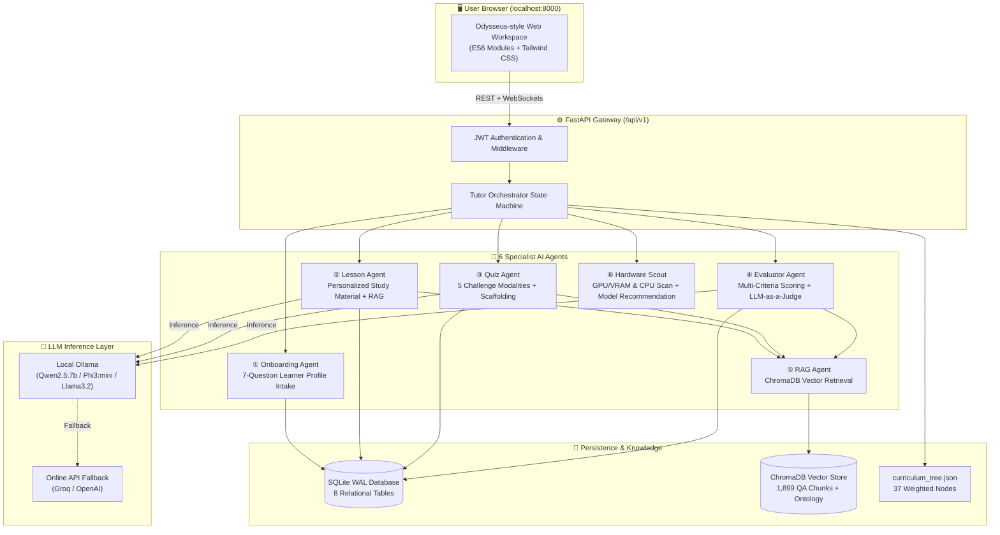

# PromptTutor AI — Adaptive Multi-Agent Intelligent Tutoring System 🎓🤖
### Undergraduate Final Year Thesis Project

**PromptTutor AI** is a research-grade, privacy-first **Intelligent Tutoring System (ITS)** designed to deliver customized, adaptive education in Prompt Engineering. The system replaces a traditional teacher by orchestrating a 6-agent AI architecture, executing open-source local LLMs via **Ollama** (with hardware-aware model recommendation), retrieving domain context via a **ChromaDB RAG vector store**, and evaluating student submissions using an empirical **5-variable adaptive scoring equation**.

---

## 🏛️ System Architecture

The following diagram illustrates the multi-agent orchestration layer, data persistence, and interactive user flow:



---

## 🌳 Curriculum Knowledge Graph (37 Nodes)

Derived from the hierarchical Prompt Engineering ontology ([`Learning Tree.png`](file:///Users/a/Downloads/Learning%20Tree.png)), structured across 3 difficulty tiers:

| Tier | Category | Weight Range | Cognitive Bloom Level | Nodes Count | Required Passing Score |
| :--- | :--- | :---: | :--- | :---: | :---: |
| **Tier 1** | **Foundational** | `1.0 – 1.5` | Remember / Understand | **11 nodes** | $\ge 50\%$ |
| **Tier 2** | **Intermediate** | `1.8 – 2.8` | Apply / Analyze | **18 nodes** | $\ge 60\%$ |
| **Tier 3** | **Advanced / Expert** | `3.0 – 4.0` | Evaluate / Create | **8 nodes** | $\ge 70\%$ |

---

## 📐 Custom Adaptive Scoring Equation

Student challenge submissions are evaluated dynamically across 5 distinct metadata variables:

$$\boxed{S_{final} = \max\!\left(0,\; \alpha \cdot Q_{semantic} + \beta \cdot Q_{rule} - \gamma \cdot H - \delta \cdot T_{penalty} - \varepsilon \cdot R_{fail}\right)}$$

Where:
* **$Q_{semantic}$ (45%, $\alpha = 0.45$):** LLM-as-a-Judge semantic quality score ($0.0 \to 1.0$) with `<think>` token filtering and JSON parsing.
* **$Q_{rule}$ (35%, $\beta = 0.35$):** Dynamic structural rubric checklist match for the specific topic.
* **$H$ ($\gamma = 0.08$):** Number of requested hints (up to 3 max, deduction $-0.08$ to $-0.24$).
* **$T_{penalty}$ ($\delta = 0.05$):** Deducted if elapsed time exceeds dynamic node time budget:
  $$T_{budget} = 60 + 20 \times W_{node}\text{ seconds}$$
* **$R_{fail}$ ($\varepsilon = 0.02$):** Prior consecutive fail streak deduction ($\min(0.02 \times \text{streak},\; 0.10)$).

---

## 🎓 Three-Phase Summative Final Examination

Unlocked only after all 37 curriculum nodes are individually mastered:
1. **Phase A: Theory MCQ (30% weight):** 10 fresh, AI-generated questions covering all ontology categories.
2. **Phase B: Applied Prompt Construction (50% weight):** 3 progressive, real-world prompt design tasks.
3. **Phase C: Portfolio Critique & Rewrite (20% weight):** 2 flawed prompts requiring defect diagnosis and production rewrites.
* **Graduation Requirement:** Overall score $\ge 65\%$ with no individual phase below $50\%$.

---

## 🚀 Quickstart & Execution

### 1. Prerequisites
- Python 3.10+
- (Optional for local LLMs) [Ollama](https://ollama.com/) running locally (`ollama run qwen2.5:7b`)

### 2. Installation
```bash
# Clone the repository
git clone https://github.com/shahariarovi789-ux/thesis-prompt-tutor.git
cd thesis-prompt-tutor

# Create virtual environment & install dependencies
python3 -m venv venv
source venv/bin/activate
pip install -r requirements.txt
```

### 3. Initialize Database & Ingest Knowledge Base
```bash
# Create SQLite tables
python scripts/create_db.py

# Ingest curriculum ontology and QA dataset into ChromaDB
python scripts/ingest_rag.py
```

### 4. Run Automated Test Suite
```bash
pytest -v
```

### 5. Launch the Web Application
```bash
python api/main.py
```
Open **`http://localhost:8000`** in your browser to access the Odysseus-style desktop interface.

---

## 🔬 Research & Analytics Telemetry

Every interaction in PromptTutor AI is logged for empirical evaluation:
- **`node_attempts`**: Full score breakdowns, semantic scores, rubric scores, time elapsed, hints used, and LLM rationale.
- **`research_metrics`**: Model latency (ms), token consumption, and response quality across local vs. cloud backends.
- **`analytics_events`**: Student behavioral triggers (hint requests, model switches, topic skips).

---

⭐️ *Developed as part of Bachelor's Thesis Research at University of Liberal Arts Bangladesh (ULAB)*
