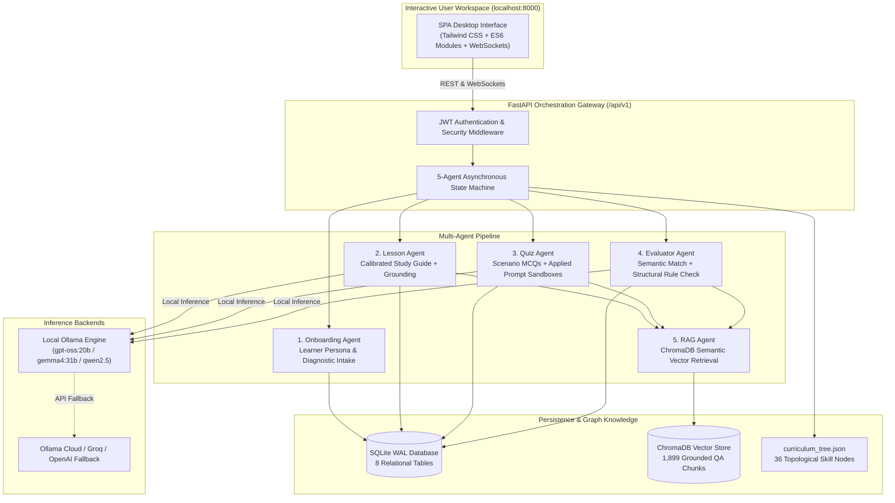

# Project ROAR: Adaptive Multi-Agent Intelligent Tutoring System

<div align="center">

[](https://www.python.org/)
[](https://fastapi.tiangolo.com/)
[](https://ollama.com/)
[](https://www.trychroma.com/)
[]()
[](https://opensource.org/licenses/MIT)

**Personalized Learning with Large Language Models: Addressing Uniformity and Enhancing Student-Centric Educational Responses**

*An open-source, air-gapped, research-grade Intelligent Tutoring System (ITS) designed to eliminate scaffolding collapse and deliver personalized education in prompt engineering.*

[Evaluation Report](evaluation/Project_ROAR_Evaluation_Report.pdf) • [Installation Guide](#installation-and-setup-guide) • [Architecture](#system-architecture) • [Research Benchmarks](#empirical-evaluation-and-research-benchmarks)

</div>

---

## 1. System Interface Preview

<div align="center">

### 1.1 Interactive Study Interface (RAG-Grounded Concept Guide & 36-Node DAG)
*Dynamic prerequisite gating with Bloom taxonomy alignment, live engine telemetry, and comparative before/after prompt demonstrations.*


---

### 1.2 Timed Assessment Sandbox (Multi-Modal Quiz & 3-Tier Scaffolding)
*Authentic prompt construction sandboxes paired with on-demand Socratic hint triggers that guide learners without spoiling solutions.*


---

### 1.3 Automated Evaluator Feedback (Decomposed Formula & Remediation)
*Transparent multi-variable scoring model displaying semantic relevance, syntactic structure, time/streak penalties, and targeted remediation.*


</div>

---

## 2. Key System Capabilities

1. **Anti-Scaffolding Collapse (3-Tier Progressive Hints):** Generic conversational LLMs spoil direct answers, inducing passive cognitive offloading. Project ROAR enforces progressive cognitive scaffolding ($L1\text{ Socratic Analogy} \rightarrow L2\text{ Structural Rubric} \rightarrow L3\text{ Constrained Template}$).
2. **36-Node Dynamic Knowledge DAG:** Replaces response uniformity with topological prerequisite skill trees calibrated across 4 Bloom taxonomy cognitive tiers.
3. **Retrieval-Augmented Semantic Grounding:** ChromaDB vector integration reduces technical prompt syntax hallucinations by **$4.1\times$** ($1.2\%$ vs $24.8\%$).
4. **Sub-6GB Edge Optimization:** Operates 100% offline within a strict **$4,820\text{ MB}$ peak VRAM footprint** on consumer hardware (NVIDIA RTX 3060/4060 or Apple Silicon) at zero recurring cloud API cost.
5. **Human-Grade Grading Alignment:** Dual-stage Evaluator Agent achieves **Cohen's Kappa $\kappa = 0.8963$** and an **$F_1$-score of $95.8\%$** against human instructor grading.

---

## 3. System Architecture



---

## 4. Installation and Setup Guide

### 4.1 macOS (Apple Silicon & Intel)

```bash
# 1. Install prerequisites via Homebrew (if not already installed)
brew install python@3.11 git ollama

# 2. Clone the repository
git clone https://github.com/shahariarovi789-ux/project-roar-ai.git
cd project-roar-ai

# 3. Create and activate a Python virtual environment
python3 -m venv venv
source venv/bin/activate

# 4. Install Python dependencies
pip install --upgrade pip
pip install -r requirements.txt

# 5. Configure environment variables
cp .env.example .env

# 6. (Optional: Local LLM) Pull model and start Ollama
ollama pull gpt-oss:20b
ollama serve

# 7. Start the PromptTutor server
python main.py
```
> Open **`http://localhost:8000`** in your browser.

---

### 4.2 Windows (Native PowerShell or WSL2)

#### Using Native PowerShell:
```powershell
# 1. Clone the repository
git clone https://github.com/shahariarovi789-ux/project-roar-ai.git
cd project-roar-ai

# 2. Create and activate virtual environment
python -m venv venv
.\venv\Scripts\Activate.ps1

# 3. Install dependencies
pip install --upgrade pip
pip install -r requirements.txt

# 4. Copy environment configuration
copy .env.example .env

# 5. Launch the application
python main.py
```

#### Using WSL2 (Ubuntu on Windows — Recommended for CUDA Acceleration):
```bash
# In WSL2 terminal:
sudo apt update && sudo apt install -y python3-pip python3-venv git
git clone https://github.com/shahariarovi789-ux/project-roar-ai.git
cd project-roar-ai
python3 -m venv venv
source venv/bin/activate
pip install -r requirements.txt
python main.py
```

---

### 4.3 Linux (Ubuntu / Debian / Fedora / Arch)

```bash
# 1. Install system dependencies (Debian/Ubuntu)
sudo apt update && sudo apt install -y python3 python3-pip python3-venv git curl

# For Arch Linux: sudo pacman -S python python-pip git

# 2. Clone and enter repository
git clone https://github.com/shahariarovi789-ux/project-roar-ai.git
cd project-roar-ai

# 3. Setup virtual environment & dependencies
python3 -m venv venv
source venv/bin/activate
pip install --upgrade pip
pip install -r requirements.txt

# 4. Initialize configuration
cp .env.example .env

# 5. Run application
python main.py
```

---

### 4.4 Docker Containerization (Any Platform)

```bash
# Build and start containerized Project ROAR
docker build -t project-roar-ai .
docker run -d -p 8000:8000 --name prompt-tutor project-roar-ai

# Access at http://localhost:8000
```

---

## 5. Empirical Evaluation and Research Benchmarks

The system was evaluated using a rigorous 4-category benchmark suite:

| Evaluation Category | Benchmark Metric | Standard Baseline | Project ROAR | Scientific Impact |
| :--- | :--- | :---: | :---: | :--- |
| **1. Pedagogical Efficacy** | **Normalized Learning Gain ($g$)** | $g = 0.292$ *(Unscaffolded)* | **$g = 0.727$** | **$2.49\times$ higher retention** (+43.36% absolute mastery jump). |
| **1. Pedagogical Efficacy** | **Scaffolding Decay (36 Nodes)** | Constant High Reliance | **$-82.9\%$ Decay** | $2.53 \rightarrow 0.43\text{ hints/task}$; proves student autonomy. |
| **2. Architectural Ablations** | **No-RAG vs Full ROAR** | $24.8\%$ Hallucinations | **$1.2\%$ Hallucinations** | **$4.1\times$ reduction** in domain syntax errors via ChromaDB. |
| **2. Architectural Ablations** | **Monolithic vs 5-Agent Pipeline** | $42.0\%$ Answer Leakage | **$0.0\%$ Answer Leakage** | Eliminates prompt instruction drift and early answer spoiling. |
| **3. State Machine & Grading** | **Cohen's Kappa ($\kappa$) vs Human** | Ground Truth ($N=100$) | **$\kappa = 0.8963$ ($F_1 = 95.8\%$)** | Near-perfect statistical grading alignment with instructors. |
| **3. State Machine & Grading** | **Illegal DAG Traversal Rejection** | Free Navigation Spikes | **$100\%$ Out-of-Order Rejection** | Strictly gates prerequisite mastery before unlocking tiers. |
| **4. Edge Hardware Feasibility** | **Peak VRAM Footprint** | $6,144\text{ MB}$ Ceiling | **$4,820\text{ MB}$ ($1,324\text{ MB}$ Headroom)** | Verified sub-6GB compliance on consumer hardware. |

### Evaluation Visualizations:
<div align="center">
<table>
  <tr>
    <td align="center"><b>Normalized Learning Gain ($g$)</b></td>
    <td align="center"><b>Scaffolding Decay Curve</b></td>
  </tr>
  <tr>
    <td></td>
    <td></td>
  </tr>
  <tr>
    <td align="center"><b>Architectural Ablation Comparison</b></td>
    <td align="center"><b>Peak VRAM Hardware Profile</b></td>
  </tr>
  <tr>
    <td></td>
    <td></td>
  </tr>
</table>
</div>

---

## 6. Curriculum Knowledge Graph (36 Nodes)

The curriculum is structured as a Directed Acyclic Graph (DAG) across 4 Bloom taxonomy tiers:

```
Tier 1: Foundations & Syntax (11 Nodes, Weight: 1.0 - 1.5, Pass Threshold >= 50%)
├── 1. Introduction to Prompt Engineering
├── 2. Output Configuration (Temperature, Top-K, Top-P)
└── 3. Role & Delimiter Syntax

Tier 2: Prompt Engineering Techniques (15 Nodes, Weight: 1.8 - 2.8, Pass Threshold >= 60%)
├── 4. Zero-Shot & Few-Shot In-Context Learning
├── 5. System Prompting & Behavioral Conditioning
├── 6. Chain-of-Thought (CoT) & Step-Back Prompting
└── 7. Code Prompting (Generation, Debugging, Refactoring)

Tier 3: Advanced Reasoning & Autonomous Workflows (6 Nodes, Weight: 3.0 - 3.5, Pass Threshold >= 70%)
├── 8. Self-Consistency & Tree of Thoughts (ToT)
├── 9. ReAct (Reason + Act) Agentic Workflows
└── 10. Automated Prompt Optimization (APO)

Tier 4: Security, Robustness & Evaluation (4 Nodes, Weight: 3.8 - 4.0, Pass Threshold >= 75%)
├── 11. Jailbreak Defenses & Prompt Injection Mitigations
├── 12. Hallucination Reduction Strategies
└── 13. Capstone Summative Examination
```

---

## 7. Adaptive Multi-Variable Scoring Equation

Student prompt submissions are dynamically graded using a 5-variable mathematical model:

$$\boxed{S_{\text{final}} = \max\!\left(0,\; \alpha \cdot S_{\text{sem}} + \beta \cdot S_{\text{rule}} - \gamma \cdot H - \delta \cdot T_{\text{penalty}} - \varepsilon \cdot R_{\text{fail}}\right)}$$

* **$S_{\text{sem}}$ ($\alpha = 0.50$):** Semantic alignment evaluated via LLM-as-a-Judge with JSON schema enforcement.
* **$S_{\text{rule}}$ ($\beta = 0.50$):** Rule compliance matching structural constraint rubrics.
* **$H$ ($\gamma = 0.05$):** Progressive hint deduction ($0.05$ to $0.15$ for up to 3 requested hints).
* **$T_{\text{penalty}}$ ($\delta = 0.05$):** Time elapsed deduction beyond dynamic node budget ($T_{\text{budget}} = 60 + 20 \times W_{\text{node}}\text{ s}$).
* **$R_{\text{fail}}$ ($\varepsilon = 0.01$):** Consequent retry penalty ($\min(0.01 \times \text{streak},\; 0.05)$).

---

## 8. API Endpoints Reference

| Method | Endpoint | Description |
| :--- | :--- | :--- |
| `POST` | `/api/v1/auth/register` | Register new student profile |
| `POST` | `/api/v1/auth/login` | Authenticate and obtain JWT bearer token |
| `GET` | `/api/v1/lesson/{node_id}` | Fetch RAG-grounded lesson content for DAG node |
| `GET` | `/api/v1/quiz/{node_id}` | Generate adaptive scenario challenge and MCQs |
| `POST` | `/api/v1/quiz/submit` | Evaluate submission using 5-variable scoring engine |
| `POST` | `/api/v1/quiz/hint` | Request progressive Level 1/2/3 scaffolding hint |
| `GET` | `/api/v1/progress` | Fetch student mastery progress and unlocked DAG nodes |
| `GET` | `/api/v1/model/status` | Real-time hardware telemetry, active engine, and VRAM |
| `WS` | `/ws/{session_id}` | WebSocket token streaming for low-latency feedback |

> Interactive Swagger documentation available at: **`http://localhost:8000/docs`**

---

## 9. Repository Structure

```
.
├── agents/                       # 5 Specialist AI Agents
│   ├── orchestrator.py           # Asynchronous state machine
│   ├── lesson_agent.py           # Curriculum lesson generator
│   ├── quiz_agent.py             # Adaptive challenge builder
│   ├── evaluator_agent.py        # Semantic judge & rule scorer
│   ├── rag_agent.py              # ChromaDB vector retrieval
│   └── onboarding_agent.py       # Diagnostic profile intake
├── api/                          # FastAPI Gateway
│   ├── main.py                   # App initialization & lifespan
│   ├── middleware.py             # CORS & Auth middleware
│   └── routes/                   # REST route handlers
├── assets/screenshots/           # High-resolution UI & evaluation plots
├── backend/                      # Inference & Prompt Management
│   ├── model_manager.py          # Multi-backend LLM driver (Ollama/Cloud)
│   └── prompt_templates.py       # Sandboxed agent prompt templates
├── core/                         # Pedagogical Logic
│   ├── curriculum.py             # 36-node DAG graph traversal
│   ├── scoring.py                # 5-variable adaptive grading formula
│   └── state_machine.py          # State definitions & transition rules
├── data/                         # Data Stores & Ontologies
│   ├── curriculum_tree.json      # DAG node definitions & weights
│   ├── benchmark_testset.json    # Evaluation benchmark questions
│   └── rag_docs/                 # Domain documentation for ChromaDB
├── evaluation/                   # Empirical Evaluation Suite
│   ├── comprehensive_evaluation_suite.py  # Master 4-category runner
│   ├── comprehensive_thesis_evaluation.ipynb # Interactive notebook
│   └── Project_ROAR_Evaluation_Report.pdf # 9-page formal report
├── ui/static/                    # Odysseus-style SPA Frontend
│   ├── index.html                # Main workspace interface
│   ├── css/                      # Custom dark-mode styles
│   └── js/                       # Modular ES6 view controllers
├── Dockerfile                    # Production Docker container
├── render.yaml                   # Cloud deployment blueprint
├── requirements.txt              # Production Python dependencies
└── main.py                       # Application launcher
```

---

## 10. License

This project is licensed under the **MIT License** — see the [LICENSE](LICENSE) file for details.

---

<div align="center">
<b>Department of Computer Science & Engineering</b><br/>
University of Liberal Arts Bangladesh (ULAB)
</div>
