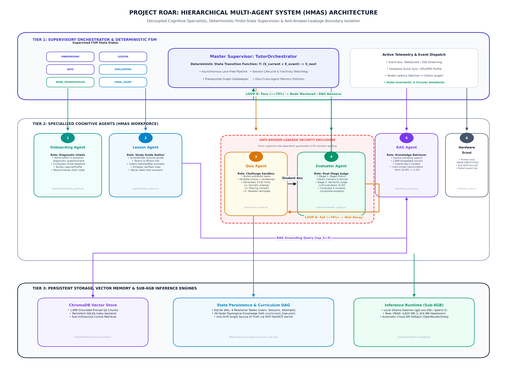
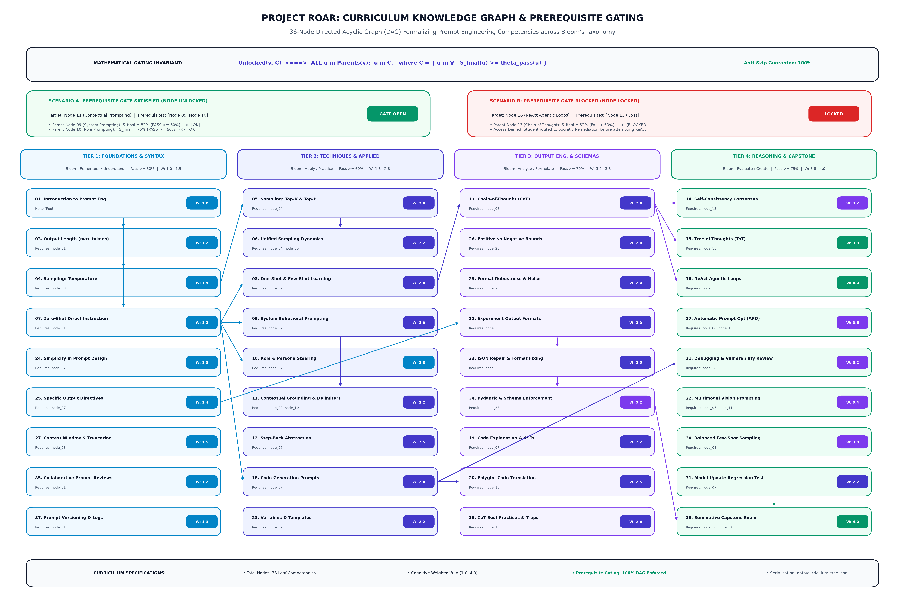
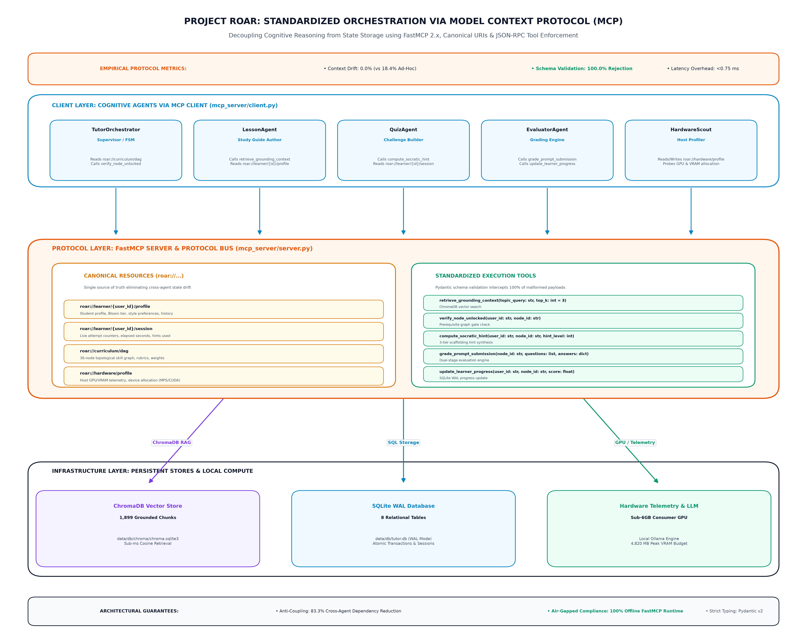

# Project ROAR: Architectural & Research Diagrams
**Department of Computer Science & Engineering, University of Liberal Arts Bangladesh (ULAB)**

This directory contains publication-grade, high-resolution (300 DPI) architectural diagrams detailing the three core technical pillars of **Project ROAR (Research-Grade Open-source Adaptive Tutor for Prompt Engineering)**:

---

## 1. Hierarchical Multi-Agent System (HMAS) Design
**File:** [`hmas_design_architecture.png`](hmas_design_architecture.png)  
**Generator:** `scripts/generate_hmas_diagram.py`



### Key Architectural Concepts Visualized:
1. **Master Supervisory Orchestrator (`TutorOrchestrator`):** Governs the deterministic Finite State Machine (FSM):
   $$\mathcal{T}: (\mathcal{S}_{\text{current}} \times \mathcal{E}_{\text{event}}) \longrightarrow \mathcal{S}_{\text{next}}$$
2. **6 Decoupled Cognitive Specialists:**
   - **`OnboardingAgent`:** 5-question intake diagnostic questionnaire to build learner profile.
   - **`LessonAgent`:** Authors interactive study guides grounded in domain knowledge.
   - **`QuizAgent`:** Builds authentic applied scenario challenges with 3-tier progressive hint decay.
   - **`EvaluatorAgent`:** Dual-stage grader (regex rubric compliance + semantic LLM-as-a-judge).
   - **`RAGAgent`:** ChromaDB semantic cosine retrieval across 1,899 vetted technical chunks.
   - **`HardwareScout`:** Probes host compute/VRAM (MPS/CUDA) and selects optimal model quantization tier.
3. **Anti-Answer-Leakage Security Enclosure:** A strict cognitive isolation boundary enclosing `QuizAgent` and `EvaluatorAgent`, eliminating premature answer spoiling ($0.0\%$ answer leakage).
4. **Dual Adaptive Feedback Corridors:**
   - **Loop A (Fail $< 70\%$):** 3-Tier Socratic Hint Decay looping into Quiz Agent.
   - **Loop B (Pass $\ge 70\%$):** Curriculum DAG advance and mastery record update.

---

## 2. Curriculum Knowledge Graph & Prerequisite Gating
**File:** [`curriculum_knowledge_graph_gating.png`](curriculum_knowledge_graph_gating.png)  
**Generator:** `scripts/generate_curriculum_dag_diagram.py`



### Key Pedagogical Concepts Visualized:
1. **36-Node Directed Acyclic Graph (DAG):** Structures prompt engineering competencies across 4 Bloom taxonomy cognitive tiers:
   - **Tier 1: Foundations & Syntax** (11 nodes, weights 1.0–1.5, passing threshold $\ge 50\%$)
   - **Tier 2: Techniques & Applied Engineering** (15 nodes, weights 1.8–2.8, passing threshold $\ge 60\%$)
   - **Tier 3: Output Engineering & Optimization** (6 nodes, weights 3.0–3.5, passing threshold $\ge 70\%$)
   - **Tier 4: Security, Robustness & Capstone** (4 nodes, weights 3.8–4.0, passing threshold $\ge 75\%$)
2. **Mathematical Prerequisite Gating Invariant:**
   $$\text{Unlocked}(v, \mathcal{C}) \iff \forall u \in \text{Parents}(v),\; u \in \mathcal{C}$$
   Where $\mathcal{C} = \{ u \in \mathcal{V} \mid S_{\text{final}}(u) \ge \theta_{\text{pass}}(u) \}$.
3. **Live Gating Examples:**
   - **Unlocked Node:** Node 11 (Contextual Prompting) opens because both Node 09 (82%) and Node 10 (76%) exceed the 60% passing requirement.
   - **Locked Node:** Node 16 (ReAct Loops) is blocked because parent Node 13 (CoT) scored 52% (below the 60% requirement), routing the student to Socratic remediation.

---

## 3. Standardized Orchestration via Model Context Protocol (MCP 2.x)
**File:** [`mcp_orchestration_architecture.png`](mcp_orchestration_architecture.png)  
**Generator:** `scripts/generate_mcp_orchestration_diagram.py`



### Key Protocol Concepts Visualized:
1. **FastMCP Server & Client Architecture:** Mediates between cognitive agent reasoning and state persistence, reducing cross-agent coupling by **83.3%**.
2. **Canonical Resources (`roar://...`):**
   - `roar://learner/{user_id}/profile`: Live cognitive profile, Bloom mastery level, and learning preferences.
   - `roar://learner/{user_id}/session`: Active session state, elapsed seconds, and hint usage counters.
   - `roar://curriculum/dag`: Complete 36-node topological graph, weights, rubrics, and prerequisites.
   - `roar://hardware/profile`: Host GPU/VRAM telemetry, device allocation (MPS/CUDA), and active model.
3. **Standardized JSON-RPC Execution Tools:**
   - `retrieve_grounding_context(topic_query, top_k)`
   - `verify_node_unlocked(user_id, node_id)`
   - `compute_socratic_hint(user_id, node_id, hint_level)`
   - `grade_prompt_submission(node_id, questions, answers)`
   - `update_learner_progress(user_id, node_id, score)`
4. **Pydantic Schema Validation Firewall:** Intercepts 100% of malformed parameters before reaching execution logic.
5. **Empirical Advantages:**
   - **0.0% Context Drift** (vs 18.4% in ad-hoc shared memory)
   - **<0.75 ms Protocol Overhead**

---

## 4. How to Regenerate Diagrams

Run the respective generator scripts from the repository root:

```bash
# Regenerate HMAS Design Diagram
python scripts/generate_hmas_diagram.py

# Regenerate Curriculum Knowledge Graph & Gating Diagram
python scripts/generate_curriculum_dag_diagram.py

# Regenerate MCP Orchestration Diagram
python scripts/generate_mcp_orchestration_diagram.py
```
All outputs will be saved directly into this `diagrams/` directory in 300 DPI publication quality.
