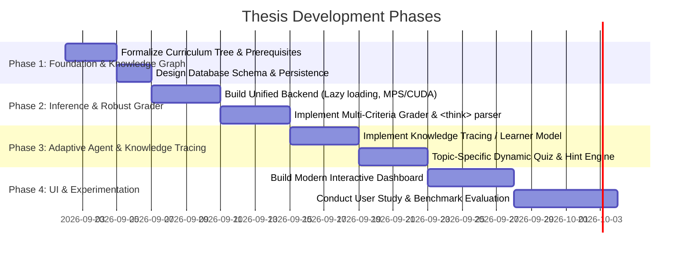

# Thesis Project Plan: Adaptive AI Tutor for Prompt Engineering

**Project Name:** Thesis Prompt Tutor (Evolution of ROAR)  
**Author / Researcher:** Shahariar Asfaq Ovi  
**Date:** September 2026  
**Status:** Inception & Architectural Planning

---

## 1. Executive Vision & Objectives

This thesis project builds upon the foundational success of the **ROAR (Rule-based Online Adaptive Prompt engineering Tutor)** capstone project. While the capstone proved the viability of local 4-bit quantized LLMs (DeepSeek-R1-Distill-Qwen-7B with LoRA) and basic adaptive state machines, this thesis project aims to elevate the system into a rigorous, research-grade **Intelligent Tutoring System (ITS)** for Prompt Engineering.

### Core Objectives:
1. **Dynamic, Topic-Grounded Pedagogy:** Move beyond static structural templates to context-aware, topic-specific challenge generation.
2. **Deep Semantic & Rubric-Based Evaluation:** Upgrade the hybrid grading loop with multi-dimensional evaluation (task alignment, constraint adherence, edge-case resilience, and structural clarity) while robustly supporting reasoning models (e.g., DeepSeek-R1 CoT parsing).
3. **Advanced Learner Modeling & Knowledge Tracing:** Implement formal cognitive modeling (Bayesian Knowledge Tracing / item response theory) to model concept mastery and predict optimal next learning steps across the curriculum.
4. **Modular & Extensible Architecture:** Decouple backend inference (Local GPU / Apple MPS / CPU / API fallback), agent orchestration, and modern frontend interfaces.

---

## 2. Prompt Engineering Knowledge Ontology (Learning Tree)

Derived directly from `Learning Tree.png`, the curriculum is structured into a hierarchical knowledge graph containing **37 weighted leaf nodes** mapped across three cognitive difficulty tiers:

### Difficulty Tier & Cognitive Weight Matrix

| Difficulty Tier | Cognitive Complexity (Bloom's Taxonomy) | Weight Range | Pedagogical Focus |
| :--- | :--- | :---: | :--- |
| **Tier 1: Foundational** | Remember / Understand | `1.0 – 1.5` | Basic prompt recall, terminology, output token parameters, basic direct zero-shot syntax |
| **Tier 2: Intermediate** | Apply / Analyze | `1.8 – 2.8` | In-context exemplars, system/role constraints, CoT elicitation, code tasks, format experimentation |
| **Tier 3: Advanced** | Evaluate / Create | `3.0 – 4.0` | Algorithmic reasoning (ToT, ReAct, APE), self-consistency consensus, formal schema enforcement, bias mitigation |

### Complete Node-by-Node Weighted Breakdown

| Node ID | Topic Path | Category | Depth | Tier | Weight | Bloom Level |
| :--- | :--- | :--- | :---: | :---: | :---: | :--- |
| `node_01` | **Introduction** | Foundations | 0 | 1 | **1.0** | Remember |
| `node_02` | **Prompt engineering** | Foundations | 0 | 1 | **1.0** | Understand |
| `node_03` | LLM output config / **Output length** | Output Config | 1 | 1 | **1.2** | Understand |
| `node_04` | LLM output config / Sampling / **Temperature** | Output Config | 2 | 1 | **1.5** | Apply |
| `node_05` | LLM output config / Sampling / **Top-K and top-P** | Output Config | 2 | 2 | **2.0** | Analyze |
| `node_06` | LLM output config / **Putting it all together** | Output Config | 1 | 2 | **2.2** | Apply |
| `node_07` | Prompting / **General prompting / zero shot** | Techniques | 1 | 1 | **1.2** | Apply |
| `node_08` | Prompting / **One-shot & few-shot** | Techniques | 1 | 2 | **2.0** | Apply |
| `node_09` | Prompting / System, role / **System prompting** | Techniques | 2 | 2 | **2.0** | Apply |
| `node_10` | Prompting / System, role / **Role prompting** | Techniques | 2 | 2 | **1.8** | Apply |
| `node_11` | Prompting / System, role / **Contextual prompting** | Techniques | 2 | 2 | **2.2** | Apply |
| `node_12` | Prompting / **Step-back prompting** | Techniques | 1 | 2 | **2.5** | Analyze |
| `node_13` | Prompting / **Chain of Thought (CoT)** | Techniques | 1 | 2 | **2.8** | Analyze |
| `node_14` | Prompting / **Self-consistency** | Techniques | 1 | 3 | **3.2** | Evaluate |
| `node_15` | Prompting / **Tree of Thoughts (ToT)** | Techniques | 1 | 3 | **3.8** | Evaluate |
| `node_16` | Prompting / **ReAct (reason & act)** | Techniques | 1 | 3 | **4.0** | Create |
| `node_17` | Prompting / **Automatic Prompt Engineering (APE)** | Techniques | 1 | 3 | **3.5** | Create |
| `node_18` | Prompting / Code / **Prompts for writing code** | Code | 2 | 2 | **2.4** | Apply |
| `node_19` | Prompting / Code / **Prompts for explaining code** | Code | 2 | 2 | **2.2** | Understand |
| `node_20` | Prompting / Code / **Prompts for translating code** | Code | 2 | 2 | **2.5** | Apply |
| `node_21` | Prompting / Code / **Prompts for debugging & reviewing** | Code | 2 | 3 | **3.2** | Analyze |
| `node_22` | Prompting / **What about multimodal prompting?** | Techniques | 1 | 3 | **3.4** | Apply |
| `node_23` | Best Practices / **Provide examples** | Best Practices | 1 | 1 | **1.4** | Understand |
| `node_24` | Best Practices / **Design with simplicity** | Best Practices | 1 | 1 | **1.3** | Apply |
| `node_25` | Best Practices / **Be specific about the output** | Best Practices | 1 | 1 | **1.4** | Apply |
| `node_26` | Best Practices / **Use Instructions over Constraints** | Best Practices | 1 | 2 | **2.0** | Analyze |
| `node_27` | Best Practices / **Control the max token length** | Best Practices | 1 | 1 | **1.5** | Apply |
| `node_28` | Best Practices / **Use variables in prompts** | Best Practices | 1 | 2 | **2.2** | Apply |
| `node_29` | Best Practices / **Experiment with input formats/styles** | Best Practices | 1 | 2 | **2.0** | Analyze |
| `node_30` | Best Practices / **Few-shot classification: mix classes** | Best Practices | 1 | 3 | **3.0** | Evaluate |
| `node_31` | Best Practices / **Adapt to model updates** | Best Practices | 1 | 2 | **2.2** | Evaluate |
| `node_32` | Best Practices / **Experiment with output formats** | Best Practices | 1 | 2 | **2.0** | Apply |
| `node_33` | **JSON Repair** | Output Eng | 0 | 2 | **2.5** | Analyze |
| `node_34` | **Working with Schemas** | Output Eng | 0 | 3 | **3.2** | Create |
| `node_35` | **Experiment with other prompt engineers** | Collaboration | 0 | 1 | **1.2** | Understand |
| `node_36` | **CoT Best practices** | Reasoning | 0 | 2 | **2.6** | Evaluate |
| `node_37` | **Document the various prompt attempts** | Workflow | 0 | 1 | **1.3** | Apply |

---

## 3. Key Enhancements over the Capstone (ROAR)

| Dimension | Capstone (ROAR) | Thesis System (Target) |
| :--- | :--- | :--- |
| **Model Backend** | Eager loading, hardcoded CUDA:0 | Lazy-loaded singleton, auto device detection (CUDA / MPS / CPU / Ollama / API) |
| **Reasoning Model Support** | Broken by raw `<think>` tokens | Robust AST/Regex extraction of CoT and structured JSON score outputs |
| **Quiz Generation** | Fixed string templates (generic task/role) | LLM-generated, topic-specific challenge scenarios grounded in curriculum |
| **Evaluation Loop** | Literal substring matching (70%) + fallback LLM (30%) | Multi-criteria rubric: Structure, Semantics, Role Adherence, Constraints, Efficiency |
| **Learner Modeling** | Basic difficulty counter ($1 \leftrightarrow 3$) | Probabilistic Mastery / Knowledge Tracing graph across interconnected subtopics |
| **Session & Analytics** | Flat SQLite table with JSON blob | Relational schema with attempt logs, mastery vectors, and telemetry for research analysis |
| **User Interface** | Monolithic Gradio script | Modern, modular interface with learning path visualizer and rich feedback panels |

---

## 4. Planned System Architecture & Modules

```
thesis-prompt-tutor/
├── core/
│   ├── __init__.py
│   ├── curriculum.py         # Knowledge tree representation, prerequisites, and graph traversal
│   ├── state_machine.py      # Adaptive learner state, difficulty adjustment, and knowledge tracing
│   └── tutor_agent.py        # Pedagogical agent: lesson delivery, dynamic quiz generation, scaffolding
├── evaluation/
│   ├── __init__.py
│   ├── grader.py             # Hybrid multi-criteria evaluator
│   ├── rule_engine.py        # Semantic pattern matcher (syntax, constraints, markers)
│   └── llm_judge.py          # Calibrated LLM-as-a-judge with structured output & error handling
├── backend/
│   ├── __init__.py
│   ├── model_manager.py      # Unified loader for Local (HF/PEFT/bitsandbytes), GGUF, or API endpoints
│   └── prompt_templates.py   # System prompts and few-shot formatting for pedagogical tasks
├── db/
│   ├── __init__.py
│   ├── schema.sql            # Relational database schema for students, attempts, mastery, and sessions
│   └── storage.py            # SQLite WAL / PostgreSQL persistence layer
├── ui/
│   ├── __init__.py
│   ├── web_app.py            # Web Dashboard (Gradio / Next.js / Streamlit)
│   └── cli_app.py            # Terminal interactive tutoring mode
├── data/
│   ├── curriculum_tree.json  # Serialized knowledge tree
│   └── dataset/              # Fine-tuning and evaluation datasets
├── tests/
│   └── ...                   # Automated unit & integration tests
├── requirements.txt          # Explicit, locked dependency specifications
└── plan.md                   # This roadmap and tracking file
```

---

## 5. Development Phases



---

## 6. User Idea & Custom Requirements Section

*(Awaiting user input for specific research hypotheses, custom pedagogical models, novel datasets, or target evaluation methodologies)*
